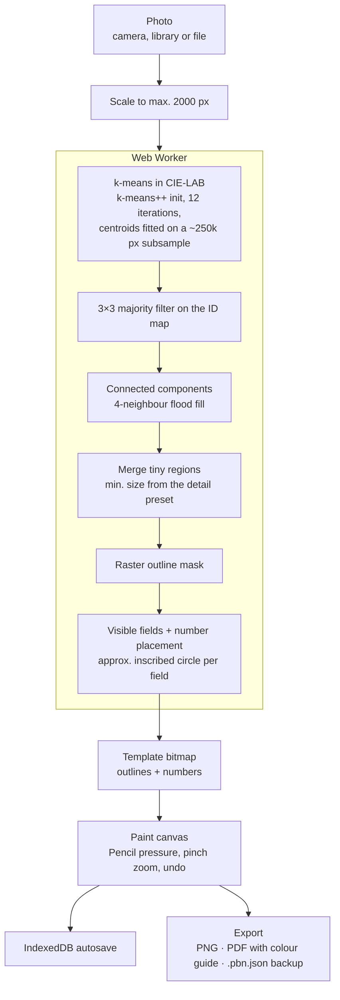
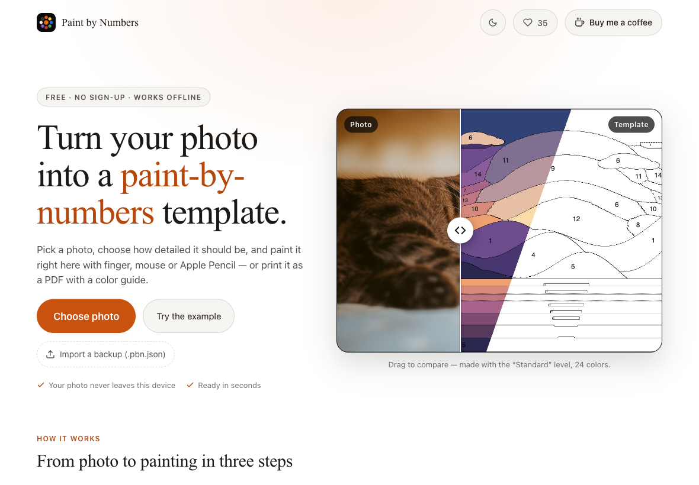
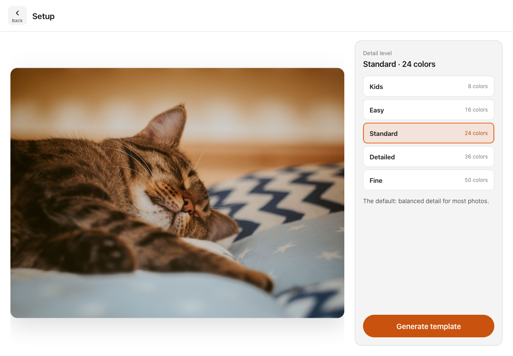
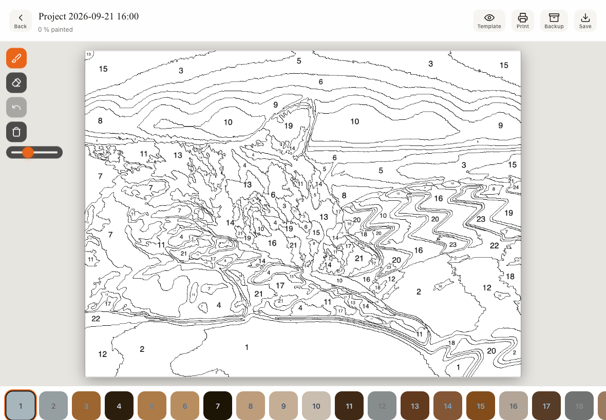
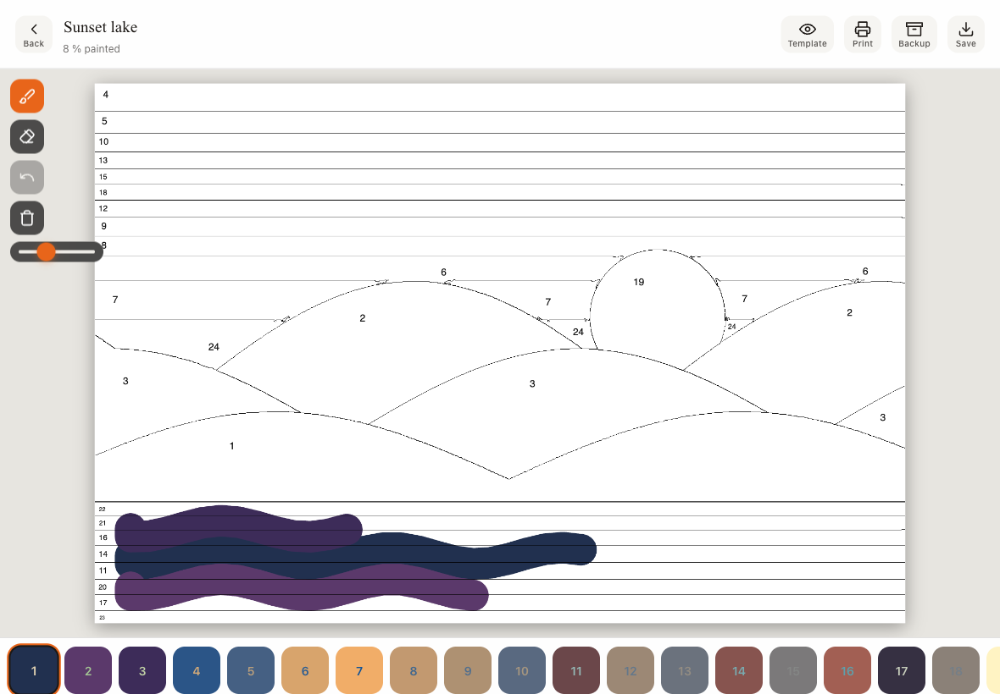

# Paint by Numbers — Photo-to-Template PWA for iPad & Apple Pencil

[](CHANGELOG.md)
[](LICENSE)
[](https://github.com/dynamicdolphino/paint-by-numbers-pwa/actions/workflows/test.yml)
[](https://dynamicdolphino.github.io/paint-by-numbers-pwa/)
[](package.json)
[](https://dynamicdolphino.github.io/paint-by-numbers-pwa/)

**Photo in → numbered template, matching palette and a pressure-sensitive canvas out.**
A progressive web app that turns any photo into a paint-by-numbers template and lets you paint
it right away — in Safari on the iPad, installed to the home screen, fully offline. No server,
no upload, no account: the image never leaves the device.

> The point of this project is not the UI but the **image pipeline written from scratch**:
> k-means colour quantisation in CIE-LAB, region labelling, tiny-region merging and number
> placement via inscribed circles — all hand-written in one Web Worker, in a single HTML file
> without a build step.

**Live:** https://dynamicdolphino.github.io/paint-by-numbers-pwa/

---

## Pipeline at a Glance



## Sample Output

Screenshots from the running app (the bundled example photo, iPad landscape viewport):

| Landing page with live example | Setup: five detail presets |
|---|---|
|  |  |

| Generated template | Painting in progress |
|---|---|
|  |  |

## What Makes This Different

- **Private by construction** — everything runs in the browser; there is no backend to send a photo to. The only third-party request is the anonymous like counter.
- **Single file, no build** — `index.html` holds markup, styles, app logic and the worker source. `git diff` stays readable, deployment is a static file on GitHub Pages.
- **Perceptual quantisation** — clustering happens in LAB, not RGB, so sky and skin do not collapse into one colour.
- **Numbers that sit inside their field** — placement uses an approximate inscribed circle instead of the bounding-box centre, so L-shaped and narrow regions are labelled correctly.
- **Built around the Pencil** — pressure-sensitive strokes start instantly, touch strokes wait for a real move (no blobs when pinching), and a resting palm is ignored while the Pencil is down.
- **iOS-PWA-proof export** — share sheet inside the user gesture, download fallback, modal with fresh gestures for the asynchronous PDF path.
- **Cheap undo** — 30 steps stored as dirty rectangles instead of full-canvas snapshots.

## Building Blocks

| File | Purpose |
|---|---|
| [index.html](index.html) | The whole app: UI, IndexedDB layer, worker source, paint engine, export |
| [sw.js](sw.js) | Service worker: precache of the shell, network-first for navigations |
| [manifest.webmanifest](manifest.webmanifest) | PWA manifest |
| [tests/worker.test.mjs](tests/worker.test.mjs) | Unit tests for the image pipeline (Node test runner, no dependencies) |
| [tests/example-assets.playwright.js](tests/example-assets.playwright.js) | Opt-in script that regenerates the landing-page example images |
| [tests/feature-assets.playwright.js](tests/feature-assets.playwright.js) + [.py](tests/feature-assets.py) | Opt-in scripts for the feature pictures (templates, paint screen, rasterised PDF pages) |
| [tests/screenshots.playwright.js](tests/screenshots.playwright.js) | Opt-in script that regenerates the README screenshots |
| [SPEC.md](SPEC.md) | Technical specification |
| [brief.md](brief.md) | Project brief: problem, goals, anti-goals |
| [BACKLOG.md](BACKLOG.md) | Open topics with IDs, done section |
| [MEMORY.md](MEMORY.md) | Chronological decision log (why, not just what) |
| [CHANGELOG.md](CHANGELOG.md) | Release history |

## Repository Structure

```
paint-by-numbers-pwa/
├── index.html                  # complete app (HTML + CSS + JS + worker source)
├── sw.js                       # service worker
├── manifest.webmanifest
├── icon-192.png / icon-512.png # app icons
├── og-image.png                # social preview
├── example.jpg / example-after.jpg  # landing-page example (photo + template)
├── step-2.jpg / step-3.jpg     # how-it-works pictures (template, painted)
├── feat-levels.jpg / feat-paint.jpg / feat-print.jpg  # landing-page feature pictures
├── robots.txt / sitemap.xml
├── tests/
│   ├── worker.test.mjs         # pipeline unit tests
│   ├── example-assets.playwright.js
│   ├── feature-assets.playwright.js / feature-assets.py
│   └── screenshots.playwright.js
├── docs/screenshots/           # README images
├── .github/workflows/test.yml  # CI: npm test
├── package.json                # scripts only, no dependencies
└── SPEC.md · brief.md · BACKLOG.md · MEMORY.md · CHANGELOG.md
```

## Tech Stack

- Vanilla HTML / CSS / JavaScript, no framework, no bundler
- Web Worker (inline, created from a Blob URL) for the image pipeline
- PointerEvents for Pencil pressure, pinch zoom and palm rejection
- IndexedDB for projects, `navigator.storage.persist()` against eviction
- Service Worker for offline use
- One optional library: [pdf-lib](https://pdf-lib.js.org/) 1.17.1, loaded on demand from cdnjs with an SRI hash, only when a PDF is exported

## Getting Started

```bash
npm start        # python3 -m http.server 8000 → http://localhost:8000
npm test         # pipeline unit tests (Node ≥ 20)
```

On the iPad: open the live URL in Safari → Share → "Add to Home Screen".

Desktop controls: mouse wheel or trackpad pinch zooms at the cursor, two-finger scroll pans,
middle mouse button or Space + drag pans as well.

## Status & Open Items

Version 0.13.0 (light + dark theme, real example photo). All findings of the 2026-09-21 review are implemented and the start screen is a landing page with a live example; the Buy-me-a-coffee URL is still a placeholder (backlog L-01); palm rejection and
focal-point pinch zoom are verified with synthetic pointer events only and still need a pass
on a real iPad with a Pencil (see [BACKLOG.md](BACKLOG.md)).

## License

MIT — see [LICENSE](LICENSE).

Example photo (`example.jpg` and the pictures derived from it): [Pexels](https://www.pexels.com/), used under the [Pexels license](https://www.pexels.com/license/).

*Working language of the project is German; everything in this repository is kept in English.*
